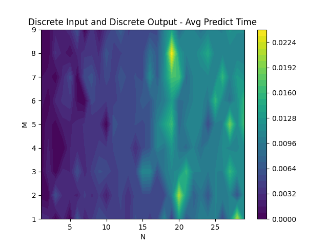
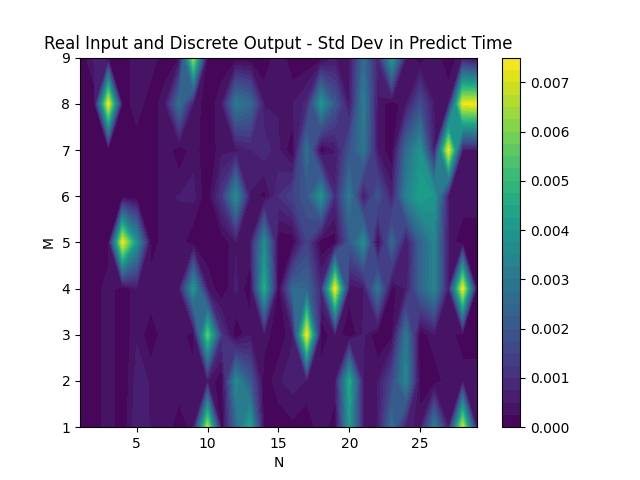

# Question 4

## Goal
The target was to plot time to fit and predict the Decision tree model against varying N, number of samples and M, number of features.

We have tested these models on 4 different types of data i.e., Discrete Input and Discrete output, Discrete Input and Real output, Real Input and Discrete output, Real Input and Real output. We have plotted the time taken to fit and predict the model against the number of samples and number of features. We have also plotted the standard deviation in time taken to fit and predict the model against the number of samples and number of features.

---
## Procedure
We used three functions to plot the graph
* `create_dataset`
* `calculate_average_time`
* `plot_results`

---
## Results
For each type of Decision Tree i.e.,
* Discrete Input and Discrete output
* Discrete Input and Real output
* Real Input and Discrete output
* Real Input and Real output

We have 4 plots, one for each of the following
* Average Time to fit the model
* Average Time to predict the model
* Standard Deviation in Time to fit the model
* Standard Deviation in Time to predict the model

So, in total we have 16 plots.

## Discrete Input and Discrete output
&nbsp;

As we can see from the above plot, the time taken to fit the model increases with the number of samples and number of features.
The time taken to predict the model is dependent on the input. The prediction ends soon in some cases and takes a lot of time in some cases. But the average time taken to predict the model is almost increases with respect to the number of samples and number of features.

&nbsp;

---

## Discrete Input and Real output
&nbsp;

&nbsp;

---

## Real Input and Discrete output
&nbsp;

As we can see from the above plot, the time taken to fit and predict the model increases with both number of samples and number of features.
The average time to predict has random flashes which shows dependence on input.

&nbsp;

---

## Real Input and Real output
&nbsp;

&nbsp;

---

## Conclusion
We have tested this model for various input but due to limitation of time and computing power of our system we could only test for small values of N and M.

For large values of N and M, we can check the mathematical time complexity of the model in following ways.

### Discrete Input
For Discrete Input, the time complexity to fit the model depends on number of samples N, number of features M and let the number of classes in a feature be of order $ O(C) .$   
${C^m}$ is the maximum number of possible combinations of features.  
So, if $ N > C^m $ then all possible inputs are exhauseted and there is repetition.  
So, the time complexity is dependent on $ O( min(N, C^m)) $  
Also for splitting the data, we have to find the best feature and best threshold, which has a complexity of $ O(NM) $  
The plots in for discrete imput are for low values of N,M and C. So, those plots are not very accurate and not able to show complete picture.  
For prediction we can at a max ask M questions of features which gives time complexity as $ O(M) $  

### Real Input
For Real Input, the time complexity to fit the model depends on number of samples N, number of features M. In each iteration, we find information gain of a coloumn with N sample and at each split it takes $ O(N) $ time.   
So, for calculation of node we have, $ O(M \times N \times N) $  
In the worst case we will have N nodes(One for each sample).  
Time complexity for fitting the model is $ O(M \times N \times N \times N) = O(N^3 M) $  

For prediction we have to traverse the worst tree of depth N completely so we have time complexity as $ O(N) $  

---
## References
* [Decision Tree Classifier](https://scikit-learn.org/stable/modules/generated/sklearn.tree.DecisionTreeClassifier.html)
* [Decision Tree Regressor](https://scikit-learn.org/stable/modules/generated/sklearn.tree.DecisionTreeRegressor.html)
* [pandas](https://devdocs.io/pandas~0.25/ )
* [numpy](https://numpy.org/devdocs/user/)
* [ID3](https://www.kdnuggets.com/2020/01/decision-tree-algorithm-explained.html )